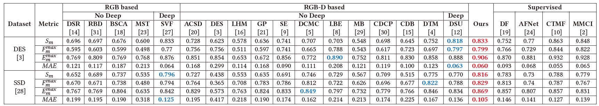

## Depth-inspired Label Mining for Unsupervised RGB-D Salient Object Detection (DLM)

### News
You can download the saliency maps through the following link.

The source code is available now.

### Available Source
- You can access the **Saliency Maps, Model Weights and Dataset** through the following links.
    - Baidu Pan: <https://pan.baidu.com/s/1HZqRAYGf8uNZOQgFRanJ1Q> Password: dkja

### Evaluation Tools
- You can use the following repository to perform the evaluation.
    - https://github.com/lartpang/PySODMetrics

## Method

## Main Results

## More Results

